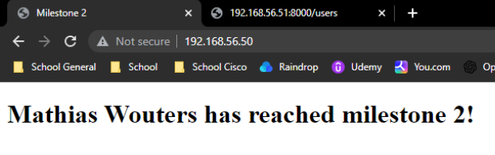
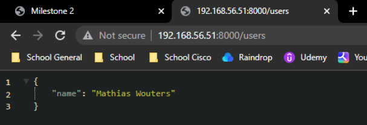
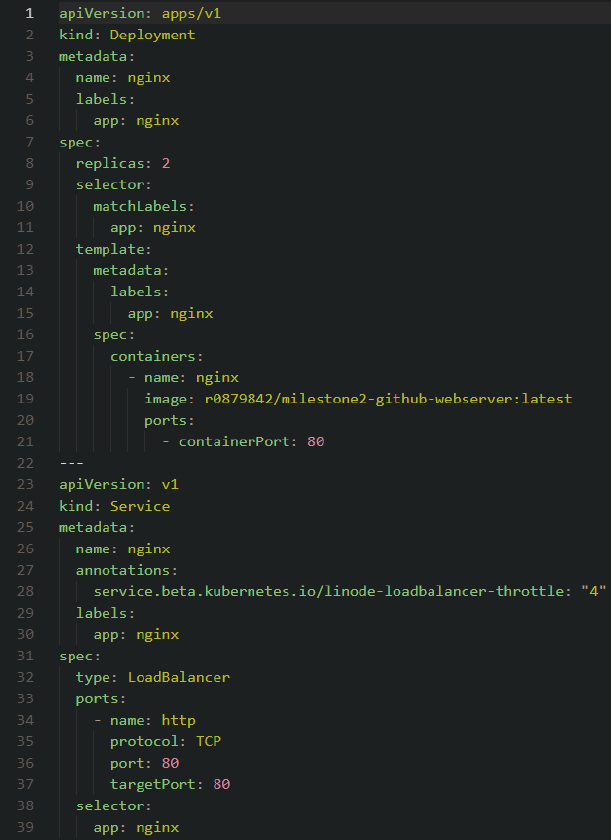

# Kubernetes Cluster

As part of the Linux Webservices course, I undertook a project focused on setting up a Kubernetes cluster. The objective was to deploy an NGINX, FastAPI, and MongoDB stack using microk8s.

**Report:** [Kubernetes Cluster report](kubernetes_cluster_report.pdf)

**Completed:** December 2022

## Kubernetes Cluster

To begin, I created a Dockerfile for my web server and API, which I then uploaded to the Docker Hub. The API itself was relatively small, primarily consisting of a GET request to retrieve user information. Additionally, I implemented a simple GET request on the root of my website to display a "hello world" message, allowing for easy verification of the API's successful operation. Leveraging the default Dockerfile provided by MongoDB on the Docker Hub, my API seamlessly interacted with the MongoDB database. YAML configuration files were prepared for each of the three services involved.

For the setup of virtual machines (VMs), I utilized Vagrant due to its simplicity and speed. I had previously developed a script that Vagrant automatically ran when creating a new VM, taking care of the installation of Docker and microk8s. In total, I employed two VMs: the first served as both the master and worker node, while the second was exclusively designated as a worker node. With everything functioning correctly, I proceeded to populate the database manually since I did not utilize a persistent volume, resulting in the inclusion of my name on the web page.

To handle load balancing, I incorporated MetalLB, which comes pre-installed with microk8s. Enabling MetalLB was a straightforward process. The same simplicity applied to the setup of the monitoring software Prometheus, which required only the enabling of the feature and port forwarding.

The goal of my Kubernetes cluster project was to deploy an NGINX, FastAPI, and MongoDB stack using microk8s, as part of the Linux Webservices course. Through careful configuration and implementation, I successfully established a functional cluster environment.

During the project, I gained valuable experience in Docker containerization, YAML configuration, and VM setup using Vagrant. I learned how to create a Dockerfile for my web server and API, upload images to the Docker Hub, and seamlessly interact with a MongoDB database. Utilizing Vagrant simplified the setup of virtual machines, allowing for quick and efficient deployment of the cluster.

By incorporating MetalLB for load balancing and Prometheus for monitoring, I ensured the scalability and observability of my cluster. These additional components enhanced the overall functionality and performance of the system.

Through this project, I achieved my personal goal of gaining hands-on experience with Kubernetes and its related tools. I developed a deeper understanding of container orchestration and learned how to create a resilient and scalable infrastructure.

Moving forward, I intend to further optimize and expand my Kubernetes cluster, exploring additional features and services to enhance its capabilities. This project has equipped me with the knowledge and skills to tackle future challenges in deploying and managing containerized applications.

In conclusion, the Kubernetes cluster I built serves as a powerful platform for deploying and managing applications at scale. It offers seamless scalability, load balancing, and monitoring capabilities, making it an ideal choice for modern application development and deployment scenarios.

